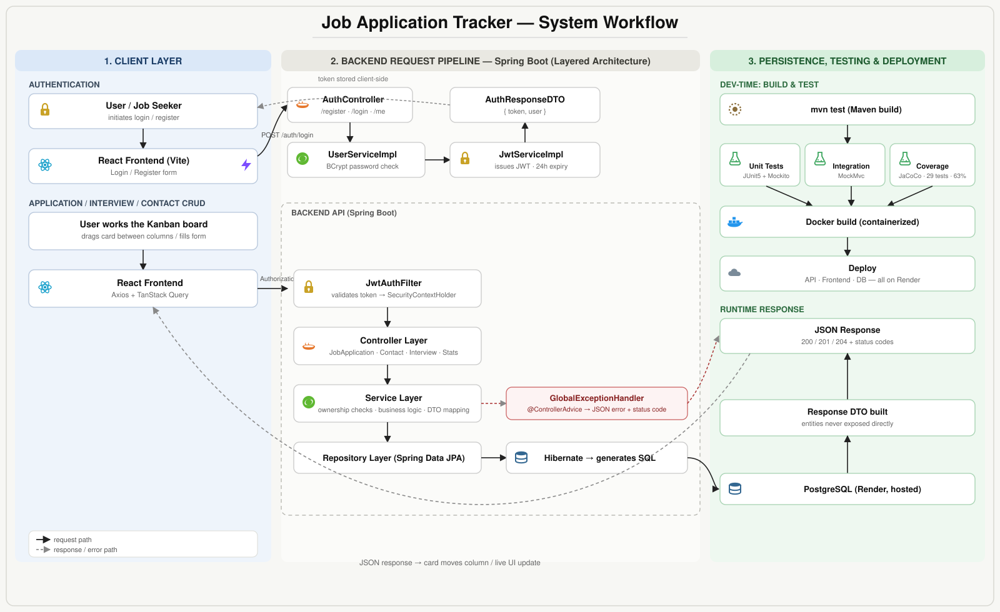

# Job Application Tracker

> A production-ready REST API for tracking a job search — log applications, interviews, and contacts, watch your pipeline on a drag-and-drop Kanban board, and see your stats in one place.


---

## What it does

Job hunting means juggling dozens of applications across spreadsheets, browser tabs, and sticky notes. This project replaces that mess with a single source of truth: a Spring Boot REST API backing a React Kanban board, where every application, interview, and contact lives in one place — secured per-user with JWT auth.

**Highlights**
- 🔐 Stateless JWT authentication with a custom filter chain and BCrypt-hashed passwords
- 🗂️ Full CRUD for applications, interviews, and contacts, each scoped to the owning user
- 📊 A `/stats` endpoint for pipeline insight, plus paginated application listing
- 🖱️ React Kanban frontend — drag cards between `APPLIED → INTERVIEWING → OFFERED / REJECTED`
- 🧪 29 unit + integration tests (JUnit 5, Mockito, MockMvc) at 63% coverage via JaCoCo
- 🐳 Dockerized and deployed — backend, frontend, and PostgreSQL all on Render

## System Workflow



The diagram shows three phases: the React client authenticating and issuing requests, the Spring Boot layered pipeline (filter → controller → service → repository → Hibernate) that processes them, and how responses flow back through testing and deployment.

## Tech Stack

| Layer | Technologies |
|---|---|
| **Backend** | Java 21, Spring Boot 3.5.14, Spring Security, Spring Data JPA / Hibernate, jjwt, Lombok, Jakarta Validation, SLF4J + Logback |
| **Database** | PostgreSQL (hosted on Render in production) |
| **Frontend** | React 18, Vite, React Router DOM, TanStack Query, Axios |
| **Testing** | JUnit 5, Mockito, MockMvc, JaCoCo |
| **DevOps** | Docker, Maven, deployed on Render (backend, frontend, and database) |

## Architecture

Strict layered architecture (MVC + Service layer):

```
HTTP Request
    ↓
JwtAuthFilter        (validates token, loads user into SecurityContextHolder)
    ↓
Controller Layer     (receives request, delegates to service, returns response)
    ↓
Service Layer        (business logic, ownership checks, DTO conversion)
    ↓
Repository Layer     (Spring Data JPA — auto-generated queries)
    ↓
Hibernate             (generates SQL)
    ↓
PostgreSQL
```

Key patterns: DTO pattern (entities are never returned directly), repository pattern, service interface + implementation split, Lombok `@Builder`, global exception handling via `@ControllerAdvice`, and stateless JWT auth.

## Getting Started

### Prerequisites
- Java 21 (LTS)
- Maven
- PostgreSQL running locally (or a Render-hosted connection string)
- Node.js 18+ (for the frontend)

### Backend

```bash
git clone https://github.com/Ahmad-009/Jobtracker.git
cd Jobtracker

# configure src/main/resources/application.properties with your DB credentials

mvn clean install
mvn spring-boot:run
```

The API starts on `http://localhost:8080`.

### Frontend

```bash
cd jobtracker-frontend
npm install
npm run dev
```

The app starts on `http://localhost:5173`.

### Running with Docker

```bash
docker build -t job-tracker .
docker run -p 8080:8080 job-tracker
```

## API Reference

| Method | Endpoint | Description |
|---|---|---|
| `POST` | `/auth/register` | Create a new account |
| `POST` | `/auth/login` | Log in, receive a JWT |
| `GET` | `/auth/me` | Get the current user's profile |
| `POST` | `/applications` | Create a job application |
| `GET` | `/applications?page=0&size=10` | List applications (paginated) |
| `GET` | `/applications/{id}` | Get one application |
| `PUT` | `/applications/{id}` | Update an application |
| `DELETE` | `/applications/{id}` | Delete an application |
| `POST` / `GET` | `/applications/{id}/contacts` | Add / list contacts |
| `PUT` / `DELETE` | `/applications/{id}/contacts/{cid}` | Update / delete a contact |
| `POST` / `GET` | `/applications/{id}/interviews` | Add / list interviews |
| `PUT` / `DELETE` | `/applications/{id}/interviews/{iid}` | Update / delete an interview |
| `GET` | `/stats` | Job search statistics |

All routes except `/auth/register` and `/auth/login` require a `Authorization: Bearer <token>` header, and every request is checked for resource ownership.

### Example: paginated response

```json
{
  "content": [ ... ],
  "totalElements": 47,
  "totalPages": 5,
  "currentPage": 0,
  "size": 10
}
```

### Example: stats response

```json
{
  "totalApplications": 47,
  "byStatus": {
    "APPLIED": 20,
    "INTERVIEWING": 12,
    "OFFERED": 3,
    "REJECTED": 10,
    "WITHDRAWN": 2
  },
  "responseRate": 53.2,
  "thisMonth": 15,
  "thisWeek": 4
}
```

## Data Model

Four entities: `users` → `job_applications` (one-to-many) → `interviews` and `contacts` (one-to-many each).

`job_applications` tracks company, title, URL, status (`APPLIED`/`INTERVIEWING`/`OFFERED`/`REJECTED`/`WITHDRAWN`), priority, job type, experience level, work type, domain, salary range, and notes.

## Security

- Passwords hashed with BCrypt
- JWTs expire after 24 hours
- `JwtAuthFilter` validates the token on every request and loads the user into `SecurityContextHolder`
- Every protected endpoint enforces per-user ownership
- CORS configured for the frontend origin

## Testing

```bash
mvn test
```

29 tests across service and controller layers, using Mockito to mock repositories (no DB required) and MockMvc + `@SpringBootTest` for integration coverage. Run `mvn test jacoco:report` to regenerate the coverage report.

## Project Structure

```
jobtracker/
├── src/main/java/com/ahmad/jobtracker/
│   ├── config/            # SecurityConfig
│   ├── controller/        # Auth, JobApplication, Contact, Interview, Stats
│   ├── dto/                # request/ and response/ DTOs
│   ├── entity/             # User, JobApplication, Contact, Interview, enums/
│   ├── exception/          # GlobalExceptionHandler + custom exceptions
│   ├── filter/              # JwtAuthFilter
│   ├── repository/         # Spring Data JPA interfaces
│   └── service/             # interfaces + implementation/
├── src/test/java/com/ahmad/jobtracker/
│   ├── service/
│   └── controller/
└── src/main/resources/
    └── application.properties
```

## Challenges & Lessons Learned

- **PostgreSQL `ident` auth on Fedora** blocked password-based connections by default — fixed by switching to `md5` in `pg_hba.conf`.
- **Java 25 vs. Spring Boot 3.3** — Boot's ASM library wasn't ready for Java 25 yet; downgraded to Java 21 LTS.
- **Circular JSON serialization** from bidirectional JPA relationships was solved by never returning entities directly — DTOs only.
- **N+1 queries** on `getById` (interviews and contacts loaded separately) required understanding lazy vs. eager loading trade-offs.
- **CORS** blocked the frontend by default until a `CorsConfigurationSource` bean was added for `localhost:5173`.
